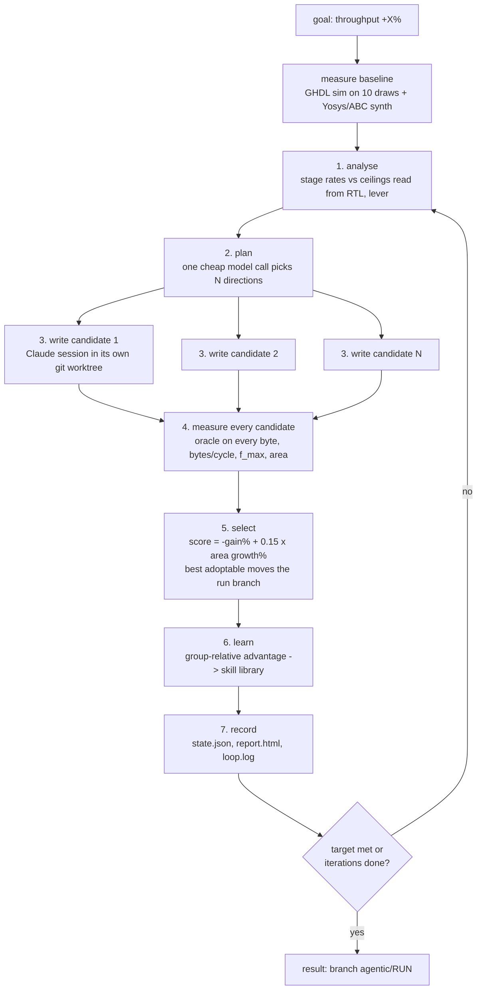

# agentic: a self-driving RTL optimisation loop

You give it a goal. It improves the design by itself, for as many iterations
as you ask, and leaves the best design on a git branch.

```
python agentic/setup.py                                   # once: check tools, build stimulus
python agentic/loop.py --goal "increase throughput by 50%" --iters 100
python agentic/loop.py --status                           # what is it doing right now
```

The design is `vhsnunzip`, a VHDL-2008 Snappy decompressor (`rtl/`). Nothing
in this folder is specific to one version of that design: the harness reads
port widths out of the RTL, so the loop can widen ports and lines freely.

## The loop, in one picture



Each candidate-writing session may read and edit `rtl/` in its worktree and
may run exactly one command, `python agentic/check.py`, which simulates the
design on invented data and compares every byte with the frozen reference
decompressor. It cannot see the data the design is scored on.

## What one iteration costs

| step | time | who |
|---|---|---|
| plan | ~20 s | one model call, no tools |
| write N candidates | 10-45 min (in parallel) | N Claude coding sessions |
| measure N candidates | ~1 min (in parallel) | GHDL + Yosys in WSL |
| learn | ~20 s | one model call, no tools |

So an iteration is 15-45 minutes and 100 iterations is one to three days.
The loop never stops because a model call failed: on a usage limit it reads
the reset time from the message, waits, and retries the same iteration.

**The real budget is the subscription's 5-hour usage window, not dollars.**
Three parallel Opus sessions can empty a Max window in one or two iterations,
after which the loop waits for the reset. That is why candidates use Sonnet
by default (about five times cheaper per token) and Opus is opt-in with
`--model opus`. An `ANTHROPIC_API_KEY` with its own budget removes the window
limit entirely.

## Setup on a fresh machine

1. Clone the design repo (the `vhsnunzip` lite layout: `rtl/`, `tb/`,
   `model/`, `vectors/`). Copy this whole `agentic/` folder into it, as a
   folder, not through git: `agentic/data/*.parquet` (the scoring data) is
   deliberately git-ignored so that a candidate worktree never contains it.
   The repo path must not contain spaces.
2. Tools where the simulator lives (WSL Ubuntu on Windows, or plain Linux):
   the OSS CAD Suite (GHDL + Yosys with the ghdl plugin) unpacked at
   `~/eda/oss-cad-suite`. Change `eda_suite` / `wsl_distro` in
   `agentic/config.json` if yours differ.
3. On the host: Python 3.10+, `pip install claude-agent-sdk`, the Claude Code
   CLI (`npm i -g @anthropic-ai/claude-code`) logged in with a subscription,
   or a real `ANTHROPIC_API_KEY`. A short placeholder key is ignored.
4. `python agentic/setup.py` checks all of that, fetches the 45 nm liberty
   file if it is missing, builds the stimulus corpus, freezes the measuring
   instrument, and self-tests the starting design. Then
   `python agentic/setup.py --commit` commits the kit (candidates start from
   HEAD, so it must be in git).

## Running

```
python agentic/loop.py --goal "increase throughput by 50%" --iters 100
python agentic/loop.py --goal "maximize throughput" --iters 30 --candidates 3
python agentic/loop.py --resume --run run-20260915-0300      # continue after a stop
python agentic/loop.py --status --run run-20260915-0300      # live view in the terminal
```

Options: `--candidates N` (parallel sessions, default 3), `--model opus`,
`--patience K` (stop after K iterations without a winner; default never),
`--max-hours H`, `--dry-run` (baseline and plan only, no coding sessions).

Goals understood: a percentage ("by 50%"), a multiplier ("2x", "double"),
or "maximize" / "as far as possible". The metric is throughput
(bytes/cycle x f_max) unless the goal says "bytes per cycle", "clock" or
"area".

## Where things go

```
.agentic/                     (git-ignored)
  corpus/<draw>/cs.tv         stimulus, built once
  runs/<run>/
    state.json                everything: baseline, every candidate, every number
    status.json               phase, iteration, best so far (rewritten every phase)
    report.html               table + charts, redrawn every iteration
    loop.log                  everything printed
    skills.json               the run's live skill library
    base/                     worktree holding the best design so far
    iter-<k>/<c>-measure/     sim logs and synthesis logs per candidate
git branches
  agentic/<run>               the result: moves to each adopted winner
  agentic-cand/<run>/i<k>-c<j>  every candidate ever tried, kept
```

To take the result: `git checkout agentic/<run>` (or merge it). Your own
checkout is never modified by the loop.

## How a candidate is judged

1. Correct: every output byte equals the frozen reference decompressor on
   all 10 draws (8 sets of real Parquet pages from TPC-H tables, 2 synthetic
   chunk sizes). A deadlock or one wrong byte rejects it.
2. Throughput = geomean bytes/cycle over the 8 real draws x f_max from
   Yosys/ABC on Nangate 45 nm. Synthetic draws must pass but do not enter
   the score (an earlier loop let one synthetic draw outvote every real one).
3. Score = -gain% + 0.15 x area growth% (+ extra above 10% area growth).
   Adopted only if gain >= 0.2% and area growth <= 60% or gain >= growth.
4. Among adoptable candidates the lowest score wins and the run branch
   moves to its commit.

## The skill library

`agentic/skills.json` holds pattern -> strategy entries with a confidence
(high / medium / low / avoid) and counters. It is seeded from an earlier
campaign on this design and from the Dr. RTL paper. After every iteration
one model call compares the group of candidates (advantage in standard
deviations from the group mean) and updates the library. Every candidate
session reads it. You can edit it by hand.

## Files

| file | job |
|---|---|
| `loop.py` | the orchestrator |
| `propose.py` | the planning call and the N coding sessions (Claude Agent SDK) |
| `learn.py` | group-relative skill learning |
| `skills.py`, `skills.json` | the skill library |
| `measure.py` | simulate all draws + synthesise, one design |
| `analyse.py` | stage rates vs ceilings read from the RTL |
| `stim.py` | the stimulus: real Parquet pages + synthetic chunks |
| `oracle.py`, `ref/snappy.py` | the frozen reference (correctness) |
| `check.py` | the one command a candidate session may run |
| `tb/vhsnunzip_perf_tc.sim.08.vhd` | width-generic throughput testbench |
| `syn/sim_draws.sh`, `syn/synth.sh`, `syn/ram_stub.vhd` | tool scripts (run in WSL/bash) |
| `report.py` | status.json and report.html |
| `freeze.py`, `frozen.json` | hashes of the measuring instrument |
| `setup.py` | doctor + preparation |
| `tools.py`, `config.json` | shared helpers and settings |
| `data/*.parquet` | the TPC-H tables the real stimulus is drawn from |

## Things that were learned the hard way (kept so they stay fixed)

- Measure with your own copy of the testbench, never the candidate's.
- Score on real data; let synthetic data only vote on correctness.
- Synthesise every candidate: three "+1% bytes/cycle" adoptions once cost
  21% of the clock.
- Read ceilings from the RTL; a hardcoded ceiling sent an earlier loop to
  widen an idle stage for weeks.
- Never work in the user's checkout; worktrees only, and keep run records
  outside the tracked tree.
- Give a session one exact command; the CLI's own safe-command list lets
  `echo` through, but everything that can read files is gated.
- A placeholder `ANTHROPIC_API_KEY` must be removed from the process
  environment, not just from the child's dict: the SDK inherits it.
