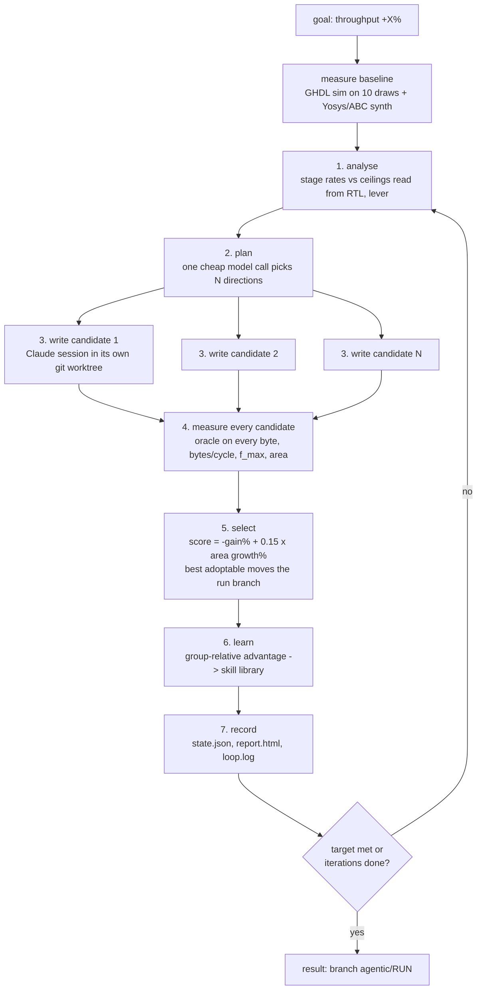

# agentic: a self-driving RTL optimisation loop

You give it a goal. It improves the design by itself, for as many iterations
as you ask, and leaves the best design on a git branch.

```
python agentic/setup.py                                   # once: check tools, build stimulus
python agentic/loop.py --goal "increase throughput by 50%" --iters 100
python agentic/loop.py --status                           # what is it doing right now
python agentic/gui.py                                     # the live dashboard window
python agentic/test_kit.py                                # checks that need no model
```

## The dashboard

`python agentic/gui.py` opens a window that watches a run. It reads the run's
two JSON files once a second and writes nothing, so it cannot affect the loop;
open it, close it, or crash it at any time.

- **The loop as a flow diagram**, with the step the run is in right now lit up,
  the iteration number, and how long it has been in that step. The step names
  are the same strings the loop writes into `status.json`, so the highlight is
  read from the run, not guessed.
- **Area and clock frequency per iteration**, plus throughput. The line is the
  design the loop kept, the filled dots are adoptions, and the hollow dots are
  every candidate it measured and rejected, so the chart shows the search and
  not just the result. Hover a dot for its name and value.
- **Headline numbers** against the baseline, and the table of what each
  iteration adopted.

`--run NAME` picks a run (the dropdown lists them all, newest first).
`--demo` replays a finished run's phases one a second, which is how to see the
highlighting without waiting for a live run. Tkinter only, no extra packages.

The design is `vhsnunzip`, a VHDL-2008 Snappy decompressor (`rtl/`). Nothing
in this folder is specific to one version of that design: the harness reads
port widths out of the RTL, so the loop can widen ports and lines freely.

## The loop, in one picture



Each candidate-writing session may read and edit `rtl/` in its worktree and
may run exactly one command, `python agentic/check.py`, which simulates the
design on invented data and compares every byte with the frozen reference
decompressor. It cannot see the data the design is scored on. Read-only
`git show/diff/log/status` and `git checkout -- rtl` are allowed too, so a
session can look at an earlier attempt and undo its own half-change.

## What a session is given before it starts

Sessions used to spend six to fourteen minutes, about 60% of the session,
working out the same things about the design that every other session had
already worked out, and then the worktree was deleted and it was paid for
again next iteration. So the loop hands over what it already knows:

- **A map of the design** (`guide.py`), generated from the RTL whenever a
  design is adopted and written to `<run>/guide.md`: port and line widths, the
  records passed between stages with every field's size, the module tree, and
  the line ranges of every process so a session reads 200 lines instead of a
  900-line file. It is generated from the code, so it cannot drift; it
  describes the design and gives no advice, so it cannot narrow what a session
  proposes.
- **The notes earlier sessions wrote.** Every session ends by writing
  `NOTES.md` under four headings (how it works, what I tried, why it worked or
  failed, facts). The loop copies them into `<run>/iter-N/`, adds the adopted
  session's "how it works" to the guide, and keeps every verified fact in
  `state.json` and in the planner's brief.
- **The starting check, already run.** The loop runs `check.py` once per
  iteration on the design all sessions start from and pastes the output into
  every brief.
- **The worst timing path, named.** Synthesis reports its critical path by net
  name (`$auto$dfflibmap$238014`); the loop maps both ends back through the
  register list to RTL names, so the brief says the path runs from
  `cmd_gen_2 c1h[0]` to `cmd_gen_2 li_off[5]` instead of leaving a session to
  guess which logic is slow.

## What one iteration costs

| step | time | who |
|---|---|---|
| plan | ~25 s | one model call, no tools |
| starting check | ~10 s | GHDL in WSL, once for every session |
| write N candidates | 10-30 min (in parallel) | N Claude coding sessions |
| measure N candidates | ~1 min with Yosys, ~20 min with Vivado (in parallel) | GHDL in WSL + the synthesis backend |
| learn | ~50 s | one model call, no tools |

So an iteration is the slowest session plus about two minutes (plus the
synthesis, under Vivado), and it ends when that session ends: sessions are
capped at `session_timeout_min` (30) and
are told when three quarters of their budget is gone, because a session that
is killed mid-change leaves a half-built design that gets measured as if it
were the change it meant to make.

Every iteration records these times as measured, not estimated: `timing` in
state.json (plan, check, write, measure with its simulation and synthesis
parts, learn), a time column in report.html, and a `time iN:` line in
loop.log. Time spent waiting for the usage window is summed in `wait_s`.

A queued schedule was tried on the HACC backend (one candidate per
iteration from a ranked list of six, the next written while the last was
measured; run hacc-q1, 15 iterations, +37.2%). The overlap hid the
synthesis, but the list went stale as soon as the first direction was
adopted, and two of fifteen sessions were thrown away because they
conflicted with a change adopted while they were being written. It was
removed; a plan made every iteration for N candidates in parallel is the
schedule.

The loop never stops because a model call failed. On a usage limit it waits
for the reset time the provider reports (the CLI sends it; the message text is
only a fallback), and it **keeps the worktrees**: after the wait the same
sessions are continued where they stopped, with their own diff and notes in
front of them, instead of the iteration being thrown away and started again.

**The real budget is the subscription's 5-hour usage window, not dollars.**
Three parallel Opus sessions can empty a Max window in one or two iterations,
after which the loop waits for the reset. That is why candidates use Sonnet
by default (about five times cheaper per token) and Opus is opt-in with
`--model opus`. An `ANTHROPIC_API_KEY` with its own budget removes the window
limit entirely.

## Setup on a fresh machine

1. Clone the design repo (the `vhsnunzip` lite layout: `rtl/`, `tb/`,
   `model/`, `vectors/`). Copy this whole `agentic/` folder into it, as a
   folder, not through git: `agentic/data/*.parquet` (the scoring data) is
   deliberately git-ignored so that a candidate worktree never contains it.
   The repo path must not contain spaces.
2. Tools where the simulator lives (WSL Ubuntu on Windows, or plain Linux):
   the OSS CAD Suite (GHDL + Yosys with the ghdl plugin) unpacked at
   `~/eda/oss-cad-suite`. Change `eda_suite` / `wsl_distro` in
   `agentic/config.json` if yours differ.
3. On the host: Python 3.10+, `pip install claude-agent-sdk`, the Claude Code
   CLI (`npm i -g @anthropic-ai/claude-code`) logged in with a subscription,
   or a real `ANTHROPIC_API_KEY`. A short placeholder key is ignored.
4. `python agentic/setup.py` checks all of that, fetches the 45 nm liberty
   file if it is missing (or, with `synth_backend` `hacc`, checks ssh to the
   host and its Vivado), builds the stimulus corpus, freezes the measuring
   instrument, and self-tests the starting design. Then
   `python agentic/setup.py --commit` commits the kit (candidates start from
   HEAD, so it must be in git).

## Running

```
python agentic/loop.py --goal "increase throughput by 50%" --iters 100
python agentic/loop.py --goal "maximize throughput" --iters 30 --candidates 3
python agentic/loop.py --resume --run run-20260915-0300      # continue after a stop
python agentic/loop.py --status --run run-20260915-0300      # live view in the terminal
```

Options: `--candidates N` (parallel sessions, default 2 from `candidates` in
config.json; the best adoptable one is kept), `--model opus`,
`--patience K` (stop after K iterations without a winner; default never),
`--max-hours H`, `--dry-run` (baseline and plan only, no coding sessions),
`--skills-from RUN` (start the library from a finished run's verified facts
and its avoid entries, with everything else reset).

Editing the kit while a run is going is safe: at the start of each iteration
the loop notices that `agentic/*.py` or `config.json` changed, checks that it
all still compiles, and restarts itself on the new code, resuming the same
run. A file that does not compile is ignored until it does.

Goals understood: a percentage ("by 50%"), a multiplier ("2x", "double"),
or "maximize" / "as far as possible". The metric is throughput
(bytes/cycle x f_max) unless the goal says "bytes per cycle", "clock" or
"area".

## Where things go

```
.agentic/                     (git-ignored)
  corpus/<draw>/cs.tv         stimulus, built once
  runs/<run>/
    state.json                everything: baseline, every candidate, every number
    status.json               phase, iteration, best so far (rewritten every phase)
    report.html               table + charts, redrawn every iteration
    loop.log                  everything printed
    skills.json               the run's live skill library
    base/                     worktree holding the best design so far
    iter-<k>/<c>-measure/     sim logs and synthesis logs per candidate
git branches
  agentic/<run>               the result: moves to each adopted winner
  agentic-cand/<run>/i<k>-c<j>  every candidate ever tried, kept
```

To take the result: `git checkout agentic/<run>` (or merge it). Your own
checkout is never modified by the loop.

## How a candidate is judged

1. Correct: every output byte equals the frozen reference decompressor on
   all 10 draws (8 sets of real Parquet pages from TPC-H tables, 2 synthetic
   chunk sizes). A deadlock or one wrong byte rejects it.
2. Throughput = geomean bytes/cycle over the 8 real draws x f_max from the
   synthesis backend (below). Synthetic draws must pass but do not enter
   the score (an earlier loop let one synthetic draw outvote every real one).
3. Score = -gain% + 0.15 x area growth%. Area is priced, not capped:
   adopted only if gain >= 0.2% (under Vivado, a gain below 1% counts only
   if bytes/cycle carries it: re-placing a design moves f_max by about a
   megahertz on its own), and when area grows more than 25% the
   efficiency (gain per percent of area) must be at least 0.2. A first
   version added a heavy penalty above 10% area growth; it rejected a +28.9%
   throughput widening at +91% area in favour of +3% at +10%, which is the
   wrong trade for a throughput goal.
4. Among adoptable candidates the lowest score wins and the run branch
   moves to its commit.

## Synthesis backends

`synth_backend` in `agentic/config.json` (or `AGENTIC_SYNTH_BACKEND`) picks
what measures f_max and area:

| | `yosys` | `hacc` |
|---|---|---|
| tool | GHDL + Yosys + ABC, in WSL | Vivado 2024.2 synthesis, place and route |
| target | Nangate 45 nm standard cells | FPGA part `hacc_part` (Alveo U55C) |
| where | this machine | the ETH HACC build host, over ssh (`hacc.py`) |
| area | um2, history RAM left out | LUTs (registers, BRAM, URAM recorded too) |
| history RAM | `syn/ram_stub.vhd`, paths through it untimed | `syn/ram_xilinx.vhd`, real URAM, timed |
| time per candidate | ~1 min, deterministic | 15-20 min, ~1 MHz place-and-route jitter |

They are different instruments on different targets and their numbers are
never compared: every result is tagged with `synth_backend`, a candidate
measured by one is refused against a parent measured by the other, and a run
will not resume under a backend other than the one that measured its
baseline. The same design reads very differently on the two. campaign1's
final design measured 641.8 MHz, 111,702 um2 and 5.626 GB/s under Yosys, and
263.0 MHz (+0.198 ns at 250 MHz), 6,698 LUTs, 4 URAM and 2.305 GB/s under
Vivado on the U55C, with its worst path inside the long decoder. An older,
larger revision of the design missed 250 MHz under Vivado with half of its
ten worst paths starting at a URAM output, which the Yosys flow cannot see.

The `hacc` backend needs key-based ssh to `hacc_host`
(`ssh -o BatchMode=yes <host> true` must succeed). Each candidate is synthesised
in its own scratch directory under `/tmp` on the host, so a round of N
candidates runs side by side. `vivado_timeout_s` (3 h) is enforced on the host
itself: Vivado and a watchdog share one session there, and the session is
killed at the deadline even if the ssh connection has gone. A candidate that
widens the `ram_command`/`ram_response` records, or declares its own
`vhsnunzip_ram`, is refused, because the fixed Xilinx RAM would silently drop
the extra bytes and the candidate would measure smaller and faster for having
broken its memory.

## What a session costs, measured

`python agentic/compare.py --breakdown <run>` prices a run's tokens at the
model it ran on. A real Fable iteration came out like this:

| | share of the bill |
|---|---|
| writing and thinking | 43% |
| reading something for the first time | 52% |
| re-reading what is already in context | 6% |

Two things follow. A thing read is charged once at the cache-write rate and
again, at a fraction of it, on every later turn, so **how much a session reads
matters more than how long its prompt is**: the whole brief, map included, is
about a tenth of what a session's file reading costs. And a fixed block that
every session carries is expensive even when nobody uses it.

That is how the MCP finding turned up. Whatever connectors the machine has
(mail, drive, calendar) were being sent to every candidate session, which may
only edit `rtl/` and run one command. Measured with two fresh prompts sharing
no cache: 41,862 cache-write tokens without `--strict-mcp-config`, 12,971 with
it. On the Fable run that block was costing about 12% of every iteration, so
the loop now always passes it.

Tried and rejected, each measured the same careful way:
`--exclude-dynamic-system-prompt-sections` changed nothing; running sessions
from different worktrees does not break the cached prefix; and naming the
unused built-in tools in `--disallowed-tools` made calls *worse*, adding about
29,000 tokens, because naming a tool pulls its schema in.

## The skill library

`agentic/skills.json` holds two kinds of entry:

- **rules**: invariants and stop rules (the chunk-boundary flush ordering,
  score on real data, do not move control across registers). They are always
  shown, never rated and never counted. A candidate that cited a rule and then
  lost says nothing about the rule, and rating them that way once left the
  flush invariant filed under "low confidence (unproven or risky)".
- **mechanisms**: things to try, with a confidence (high / medium / low /
  avoid) and counters.

After every iteration one model call reads the group of candidates and updates
the library. Three things it cannot do: change a rating without naming one (a
note-only update used to demote the skill it was describing), rewrite a
pattern or strategy (one failed attempt once turned "widen the line" into "be
cautious about widening the line", and widening was what eventually won by
+19%), or have its result charged to a session that was cut off mid-change. It
adds short caveats under a strategy instead, and a rewrite needs an explicit
`replace_strategy` and an adoption behind it.

Each result is counted against **one** mechanism: the first skill the planner
assigned, or the `primary_skill` the session names in `PROPOSAL.json` when it
deviated. Group advantage is only recorded when three or more candidates were
scored, because with two candidates it is always +1 or -1.

Starting a new campaign from the previous one's learned library is a bad idea:
that library describes a design that no longer exists. `--skills-from <run>`
(or `python agentic/skills.py --distil <run-dir>`) carries over only what stays
true: the facts sessions verified, and the mechanisms measured not worth trying
again, each tagged with the design state it was measured on. Everything else
resets.

## Files

| file | job |
|---|---|
| `loop.py` | the orchestrator |
| `propose.py` | the planning call and the N coding sessions (Claude Agent SDK) |
| `learn.py` | group-relative skill learning |
| `skills.py`, `skills.json` | the skill library |
| `measure.py` | simulate all draws + synthesise, one design |
| `analyse.py` | stage rates vs ceilings read from the RTL |
| `guide.py` | the map of the current design, generated from the RTL |
| `test_kit.py` | checks for the notebook, the analyser, the guide and the timing report |
| `stim.py` | the stimulus: real Parquet pages + synthetic chunks |
| `oracle.py`, `ref/snappy.py` | the frozen reference (correctness) |
| `check.py` | the one command a candidate session may run |
| `tb/vhsnunzip_perf_tc.sim.08.vhd` | width-generic throughput testbench |
| `syn/sim_draws.sh`, `syn/synth.sh`, `syn/ram_stub.vhd` | tool scripts (run in WSL/bash) |
| `hacc.py`, `syn/vivado.tcl`, `syn/ram_xilinx.vhd` | the Vivado backend on the HACC host |
| `report.py` | status.json and report.html |
| `gui.py` | the live dashboard window (Tkinter) |
| `freeze.py`, `frozen.json` | hashes of the measuring instrument |
| `setup.py` | doctor + preparation |
| `tools.py`, `config.json` | shared helpers and settings |
| `data/*.parquet` | the TPC-H tables the real stimulus is drawn from |

## Things that were learned the hard way (kept so they stay fixed)

- Measure with your own copy of the testbench, never the candidate's.
- Score on real data; let synthetic data only vote on correctness.
- Synthesise every candidate: three "+1% bytes/cycle" adoptions once cost
  21% of the clock.
- Read ceilings from the RTL; a hardcoded ceiling sent an earlier loop to
  widen an idle stage for weeks.
- Never work in the user's checkout; worktrees only, and keep run records
  outside the tracked tree.
- Give a session one exact command; the CLI's own safe-command list lets
  `echo` through, but everything that can read files is gated.
- A placeholder `ANTHROPIC_API_KEY` must be removed from the process
  environment, not just from the child's dict: the SDK inherits it.
- Count the element kinds separately. Pooling copies and literals into one
  "decode engine" rate hid a copy slot running at 82-93% of its ceiling behind
  an idle literal slot; the loop concluded "no stage saturated, look for
  latency" and spent three iterations hunting bubbles its own learner had
  already ruled out.
- Reading is cheap and thinking is expensive (4x to 200x per token on the
  large models), so a smaller prompt saves little. What saves real money is
  not making every session work the same things out again.
- Tell a session where it stands. Three of four sessions on the expensive
  model were killed by the dollar cap mid-change, and one had switched its own
  mechanism off to ship something that passed; the measurement was then
  recorded against the mechanism it had disabled.
- On Windows, `os.execv` re-quotes the program path, so an interpreter under a
  user folder with a space in its name comes back split. The loop restarts
  itself as a child process instead.
